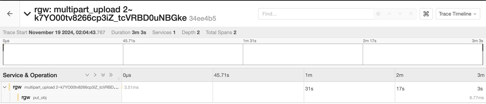

* install the toolbox pod (currently lua script can only be loaded by an admin command):
```bash
kubectl create -f https://raw.githubusercontent.com/rook/rook/refs/heads/master/deploy/examples/toolbox.yaml
```
* upload a lua script to trace only multipart upload requests:
```bash
TOOLBOX_POD=$(kubectl -n rook-ceph get pods -l=app=rook-ceph-tools -o jsonpath='{.items[0].metadata.name}')
kubectl -n rook-ceph cp multipart-trace.lua $TOOLBOX_POD:/tmp/multipart-trace.lua
kubectl -n rook-ceph exec -it deploy/rook-ceph-tools -- bash -c "radosgw-admin script put --context=prerequest --infile /tmp/multipart-trace.lua"
```

# Multipart Upload

1. Create a large test file

echo 123 > large_test_file

```jsx
echo 123 > large_test_file
```

2. start a multipart upload

```jsx
 aws --endpoint-url $AWS_URL s3api create-multipart-upload --bucket $BUCKET_NAME --key large_test_file
 {
    "Bucket": "ceph-bkt-f45a3275-3b97-4cb1-8c75-af0d0db58721",
    "Key": "large_test_file",
    "UploadId": "2~k7YO00tv8266cp3iZ_tcVRBD0uNBGke"
}

```



3. upload the first part of multipart upload using the UploadID generated from previous command

```jsx
 aws --endpoint-url $AWS_URL s3api upload-part --bucket $BUCKET_NAME --key large_test_file --part-number 1 --body large_test_file --upload-id 2~k7YO00tv8266cp3iZ_tcVRBD0uNBGke
 {
    "ETag": "\"ba1f2511fc30423bdbb183fe33f3dd0f\""
}
```

4. list the multipart upload for the file `large_test_file`

```jsx
aws --endpoint-url $AWS_URL s3api list-parts --bucket $BUCKET_NAME --key large_test_file --upload-id 2~k7YO00tv8266cp3iZ_tcVRBD0uNBGke
{
    "Parts": [
        {
            "PartNumber": 1,
            "LastModified": "2024-11-18T20:37:46.599000+00:00",
            "ETag": "\"ba1f2511fc30423bdbb183fe33f3dd0f\"",
            "Size": 4
        }
    ],
    "ChecksumAlgorithm": null,
    "Initiator": null,
    "Owner": {
        "DisplayName": "obc-default-ceph-delete-bucket-f44c84e6-7075-47e6-b3ae-4daea3637950",
        "ID": "obc-default-ceph-delete-bucket-f44c84e6-7075-47e6-b3ae-4daea3637950"
    },
    "StorageClass": "STANDARD"
}
```


5. complete the multipart upload

```jsx
echo '{"Parts":[{"ETag":"ba1f2511fc30423bdbb183fe33f3dd0f","PartNumber":1}]}' > etag.json
aws --endpoint-url $AWS_URL s3api complete-multipart-upload --multipart-upload file://etag.json --bucket $BUCKET_NAME --key large_test_file --upload-id 2~k7YO00tv8266cp3iZ_tcVRBD0uNBGke

{
    "Location": "http://127.0.0.1:32217/ceph-bkt-f45a3275-3b97-4cb1-8c75-af0d0db58721/large_test_file",
    "Bucket": "ceph-bkt-f45a3275-3b97-4cb1-8c75-af0d0db58721",
    "Key": "large_test_file",
    "ETag": "805c1cc04b820ee6f0fd7ca1744cdf3c-1"
}
```


